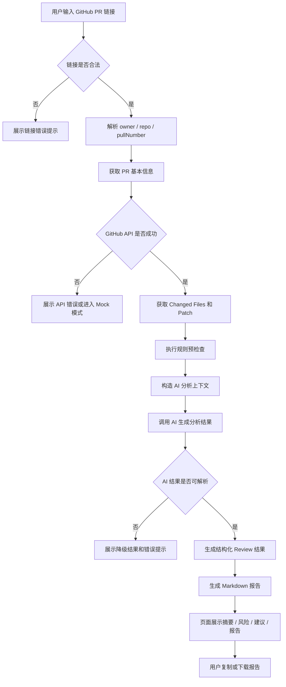

# PR Lens 核心业务流程文档

## 1. 文档目的

本文档用于说明 PR Lens 的核心业务流程，明确用户从输入 GitHub Pull Request 链接到获得 AI Review 报告的完整路径。

本文档重点说明：

- 用户如何使用 PR Lens。
- 系统如何处理 GitHub PR 链接。
- 每个核心环节的输入和输出。
- MVP 阶段必须完成的业务流程。
- 异常情况下的兜底策略。
- Mock 模式在业务流程中的作用。

## 2. 核心业务目标

PR Lens 的核心业务目标是：

> 帮助开发者在正式 Review 一个 GitHub PR 前，快速理解 PR 变更内容、识别潜在风险，并生成一份可复制或可下载的 Markdown Review 报告。

PR Lens 不替代人工 Review，不自动判断 PR 是否可以合并，也不直接向 GitHub 发布评论。

MVP 阶段只完成一条核心主流程：

```text
输入公开 GitHub PR 链接
-> 获取 PR 信息
-> 获取变更文件
-> 执行规则预检查
-> 调用 AI 分析
-> 生成 Review 报告
-> 展示与复制结果
```

## 3. 核心用户角色

### 3.1 Reviewer

Reviewer 是 PR Lens 的主要用户。

典型使用场景：

- 收到同事提交的 Pull Request。
- 需要快速判断该 PR 改了什么。
- 需要定位风险较高的文件。
- 需要生成 Review 评论草稿。

核心需求：

- 快速理解 PR 变更范围。
- 优先定位风险代码。
- 获得具体、可执行的 Review 建议。
- 减少人工阅读 diff 前的初筛成本。

### 3.2 PR 作者

PR 作者是 PR Lens 的次要用户。

典型使用场景：

- 准备将 PR 提交给团队 Review。
- 希望提前自查明显问题。
- 希望补充测试、错误处理或说明文档。

核心需求：

- 在正式 Review 前发现潜在风险。
- 优化 PR 描述和代码质量。
- 降低 PR 被反复打回的概率。

## 4. 核心业务流程总览

### 4.1 主流程

```text
用户输入 GitHub PR 链接
-> 系统校验并解析链接
-> 系统获取 PR 基本信息
-> 系统获取变更文件和 patch
-> 系统执行规则预检查
-> 系统构造 AI 分析上下文
-> AI 生成摘要、风险和建议
-> 系统生成 Markdown Review 报告
-> 用户查看、复制或下载报告
```

### 4.2 流程图



## 5. 详细业务流程

### 5.1 流程一：输入 PR 链接

#### 用户行为

用户进入首页，在输入框中粘贴 GitHub PR 链接。

示例：

```text
https://github.com/octocat/hello-world/pull/123
```

用户可以点击：

```text
开始分析
```

也可以点击：

```text
使用示例 PR 快速体验
```

#### 系统处理

系统在前端对输入内容进行基础校验：

- 是否为空。
- 是否是 GitHub 链接。
- 是否符合 Pull Request 链接格式。
- 是否可以解析出 `owner`、`repo`、`pullNumber`。

#### 输入

```typescript
type PullRequestInput = {
  url: string;
};
```

#### 输出

如果解析成功：

```typescript
type ParsedPullRequestUrl = {
  owner: string;
  repo: string;
  pullNumber: number;
};
```

如果解析失败：

```text
请输入有效的 GitHub PR 链接，例如：
https://github.com/owner/repo/pull/123
```

#### 页面表现

成功时：

- 进入分析流程。
- 显示加载状态：`正在解析 PR 链接`。

失败时：

- 在输入框下方展示错误提示。
- 不进入下一步流程。

### 5.2 流程二：获取 PR 基本信息

#### 用户行为

用户无需额外操作，系统自动处理。

#### 系统处理

系统通过 GitHub API 获取 PR metadata。

需要获取的信息包括：

- PR 标题。
- PR 作者。
- PR 描述。
- 仓库名称。
- 源分支。
- 目标分支。
- changed files 数量。
- additions。
- deletions。

#### 输入

```typescript
type ParsedPullRequestUrl = {
  owner: string;
  repo: string;
  pullNumber: number;
};
```

#### 输出

```typescript
type PullRequestMeta = {
  owner: string;
  repo: string;
  pullNumber: number;
  title: string;
  author: string;
  description?: string;
  baseBranch: string;
  headBranch: string;
  changedFiles: number;
  additions: number;
  deletions: number;
};
```

#### 页面表现

展示 PR 信息卡片：

```text
PR 标题
仓库名称
作者
源分支 -> 目标分支
变更文件数
新增行数
删除行数
```

#### 异常处理

如果 GitHub API 请求失败：

- 展示明确错误提示。
- 提供 `使用 Mock 示例继续体验` 按钮。
- 页面不崩溃。

错误提示示例：

```text
无法获取该 PR 信息，请确认链接是否正确，或该 PR 是否为公开仓库。
```

### 5.3 流程三：获取 Changed Files 和 Patch

#### 用户行为

用户无需额外操作。

#### 系统处理

系统获取 PR 的变更文件列表。

每个文件需要包含：

- 文件名。
- 文件状态。
- 新增行数。
- 删除行数。
- patch 内容。

#### 输入

```typescript
type PullRequestMeta = {
  owner: string;
  repo: string;
  pullNumber: number;
  title: string;
  author: string;
  description?: string;
  baseBranch: string;
  headBranch: string;
  changedFiles: number;
  additions: number;
  deletions: number;
};
```

#### 输出

```typescript
type ChangedFile = {
  filename: string;
  status: "added" | "modified" | "removed" | "renamed";
  additions: number;
  deletions: number;
  patch?: string;
};

type ChangedFileList = ChangedFile[];
```

#### 页面表现

MVP 阶段至少展示文件列表：

```text
文件名
状态
新增行数
删除行数
```

可选展示：

```text
查看 Diff
展开 / 收起
```

Diff 展示属于 P1 增强功能，不是 MVP 必须项。

#### 异常处理

如果获取 changed files 失败：

```text
无法获取 PR 变更文件，请稍后重试或使用示例数据体验。
```

### 5.4 流程四：规则预检查

#### 用户行为

用户无需额外操作。

#### 系统处理

系统在调用 AI 前，对 changed files 进行基础规则检查。

规则预检查的目标是：

- 帮助系统找出值得重点分析的文件。
- 为 AI 提供风险提示上下文。
- 在 AI 调用失败时仍能展示基础风险结果。

规则预检查不是最终 Review 结论，只作为辅助判断。

#### 检查规则

| 规则 | 命中示例 | 风险原因 |
| --- | --- | --- |
| 依赖文件变更 | `package.json`、`package-lock.json`、`pnpm-lock.yaml`、`requirements.txt`、`go.mod`、`pom.xml` | 依赖变更可能引入安全、体积、兼容性或维护风险。 |
| 配置文件变更 | `.env.example`、`config/*`、`settings/*`、`docker-compose.yml`、`.github/workflows/*` | 配置变更可能影响部署、环境变量、CI 流程或运行行为。 |
| 鉴权与权限相关变更 | `auth`、`token`、`permission`、`session`、`jwt`、`login`、`role`、`access` | 鉴权或权限逻辑变更可能影响访问控制和系统安全。 |
| 疑似硬编码敏感信息 | `api_key`、`secret`、`password`、`access_token`、`private_key`、`client_secret` | 代码中疑似出现敏感字段，需要人工确认是否存在密钥泄露风险。 |
| 大量删除 | 单文件删除行数超过设定阈值，例如 80 行 | 大量删除可能移除了关键逻辑，需要人工确认是否符合预期。 |
| 新增外部调用 | `fetch`、`axios`、`request`、`http`、`database`、`query` | 新增外部调用可能涉及错误处理、超时、重试和数据安全问题。 |

#### 输入

```typescript
type ChangedFileList = ChangedFile[];
```

#### 输出

```typescript
type RuleCheckResult = {
  filename: string;
  ruleId: string;
  level: "high" | "medium" | "low";
  reason: string;
};

type RuleCheckResultList = RuleCheckResult[];
```

#### 页面表现

规则预检查结果可以在风险列表中展示，也可以作为 AI 风险结果的补充。

示例：

```text
文件：src/services/auth.ts
等级：High
原因：该文件涉及 token / auth 相关逻辑，需要人工重点确认。
```

### 5.5 流程五：构造 AI 分析上下文

#### 用户行为

用户无需额外操作。

#### 系统处理

系统将 PR 信息、文件变更和规则预检查结果整理成 AI 可理解的上下文。

MVP 阶段不做复杂全仓库索引，只使用以下内容：

- PR 标题。
- PR 描述。
- PR 基本信息。
- changed files 列表。
- 每个文件的 patch。
- 规则预检查结果。

#### 上下文裁剪原则

如果 PR 内容过大，优先保留：

- 规则预检查命中的文件。
- 鉴权、配置、依赖、数据处理相关文件。
- 新增逻辑较多的文件。
- 删除逻辑较多的文件。
- PR 描述中提到的文件。

降低优先级：

- lock 文件。
- 纯样式文件。
- 自动生成文件。
- 静态资源。
- 纯格式化变更。

#### 输入

```typescript
type ReviewContextInput = {
  pullRequestMeta: PullRequestMeta;
  changedFiles: ChangedFile[];
  ruleCheckResults: RuleCheckResult[];
};
```

#### 输出

```typescript
type AIReviewContext = {
  prTitle: string;
  prDescription?: string;
  repository: string;
  changedFilesSummary: string;
  selectedPatches: string;
  ruleFindings: string;
};
```

#### 异常处理

如果 patch 过长：

```text
系统将自动裁剪上下文，并在报告中说明部分文件未完整分析。
```

### 5.6 流程六：AI 生成 Review 分析

#### 用户行为

用户无需额外操作。

#### 系统处理

系统调用 AI 模型，要求返回结构化 JSON。

AI 不直接输出自由文本长文，而是输出可被页面解析和展示的结构化结果。

#### AI 需要完成的任务

- 生成 PR 变更摘要。
- 提炼重点变更。
- 识别风险代码或风险文件。
- 生成 Review 建议。
- 标记需要人工确认的问题。

#### 输入

```typescript
type AIReviewContext = {
  prTitle: string;
  prDescription?: string;
  repository: string;
  changedFilesSummary: string;
  selectedPatches: string;
  ruleFindings: string;
};
```

#### 输出

```typescript
type ReviewRisk = {
  filename: string;
  level: "high" | "medium" | "low";
  title: string;
  reason: string;
  suggestion: string;
  requiresHumanCheck: boolean;
};

type ReviewResult = {
  summary: string;
  keyChanges: string[];
  risks: ReviewRisk[];
  suggestions: string[];
  markdownReport?: string;
};
```

#### 输出要求

AI 输出必须满足：

- 不编造不存在的业务背景。
- 不把猜测写成确定结论。
- 每条风险尽量指向具体文件。
- 建议必须具体、可执行。
- 高风险建议需要说明原因。
- 如果信息不足，应标记为需要人工确认。

#### 异常处理

如果 AI 调用失败：

- 展示错误提示。
- 保留 PR 基本信息和规则预检查结果。
- 提供 Mock 示例模式。
- 页面不崩溃。

错误提示示例：

```text
AI 分析失败，当前可查看 PR 基本信息和规则预检查结果。
```

如果 AI 输出 JSON 解析失败：

- 尝试提取可用内容。
- 展示降级结果。
- 提示用户当前仅展示部分分析结果。

错误提示示例：

```text
AI 返回格式异常，当前展示部分可用分析结果。
```

### 5.7 流程七：生成 Markdown Review 报告

#### 用户行为

用户在结果页查看报告，可以复制或下载。

#### 系统处理

系统根据 PR 基本信息、规则预检查结果和 AI Review 结果，生成 Markdown 文本。

#### 报告结构

```markdown
# PR Review 报告

## 1. PR 基本信息

- 仓库：
- PR：
- 作者：
- 源分支：
- 目标分支：
- 变更文件数：
- 新增 / 删除：

## 2. 变更摘要

这里展示 AI 生成的摘要。

## 3. 重点变更

- 变更点 1
- 变更点 2
- 变更点 3

## 4. 风险列表

### High

- 文件：
- 风险：
- 原因：
- 建议：

### Medium

- 文件：
- 风险：
- 原因：
- 建议：

### Low

- 文件：
- 风险：
- 原因：
- 建议：

## 5. Review 建议

- 建议 1
- 建议 2
- 建议 3

## 6. 需要人工确认的问题

- 问题 1
- 问题 2

## 7. AI 分析限制

本报告由 AI 辅助生成，可能存在误报或漏报。最终 Review 结论应由开发者人工判断。
```

#### 输入

```typescript
type ReportBuilderInput = {
  pullRequestMeta: PullRequestMeta;
  changedFiles: ChangedFile[];
  ruleCheckResults: RuleCheckResult[];
  reviewResult: ReviewResult;
};
```

#### 输出

```typescript
type MarkdownReport = string;
```

#### 页面表现

页面展示：

- Markdown 报告预览。
- 复制 Markdown 按钮。
- 下载 Markdown 按钮。

### 5.8 流程八：展示结果

#### 用户行为

用户查看分析结果。

#### 页面展示模块

##### 模块一：PR 基本信息卡片

展示：

- PR 标题。
- 仓库名称。
- 作者。
- 分支信息。
- 变更文件数。
- 新增 / 删除行数。

##### 模块二：变更摘要

展示：

- AI 总结。
- 影响模块。
- Reviewer 优先关注点。

##### 模块三：风险列表

按风险等级展示：

- High 风险。
- Medium 风险。
- Low 风险。

每条风险展示：

- 文件名。
- 风险标题。
- 风险原因。
- 建议处理方式。
- 是否需要人工确认。

##### 模块四：Review 建议

建议可以按以下类型组织：

- Correctness。
- Security。
- Maintainability。
- Testing。
- Documentation。

MVP 阶段不强制做复杂分类，如果开发时间有限，可以只展示普通建议列表。

##### 模块五：Markdown 报告

展示：

- 报告预览。
- 复制按钮。
- 下载按钮。

### 5.9 流程九：复制或下载报告

#### 用户行为

用户点击：

```text
复制 Markdown
```

或：

```text
下载 Markdown
```

#### 系统处理

复制时：

- 将 Markdown 文本写入剪贴板。
- 按钮展示 `已复制`。

下载时：

- 将 Markdown 文本生成 `.md` 文件。
- 文件名可以使用 PR 编号。

文件名示例：

```text
pr-lens-review-owner-repo-123.md
```

#### 异常处理

如果复制失败：

```text
复制失败，请手动选择报告内容复制。
```

如果下载失败：

```text
下载失败，请使用复制功能保存报告。
```

## 6. Mock 演示流程

Mock 模式是 PR Lens MVP 的兜底流程，必须保留。

### 6.1 使用场景

Mock 模式用于：

- GitHub API 不稳定。
- AI API 不稳定。
- 本地没有配置 API Key。
- 演示时需要稳定展示完整流程。

### 6.2 Mock 流程

```text
用户点击“使用示例 PR 快速体验”
-> 系统加载内置 PR 示例数据
-> 系统加载内置分析结果
-> 页面展示完整结果
-> 用户复制或下载 Markdown 报告
```

### 6.3 Mock 数据需要覆盖

Mock 数据至少包含：

- PR 基本信息。
- 变更文件列表。
- 规则预检查结果。
- AI 摘要。
- 风险列表。
- Review 建议。
- Markdown 报告。

### 6.4 页面提示

页面必须明确提示：

```text
当前为示例数据 Mock 模式，用于演示产品主流程。
```

Mock 数据不能伪装成真实分析结果。

## 7. 异常业务流程

### 7.1 非法 PR 链接

#### 触发条件

用户输入：

- 空内容。
- 非 GitHub 链接。
- 非 PR 链接。
- 缺少 PR 编号的链接。

#### 系统处理

展示错误：

```text
请输入有效的 GitHub PR 链接。
```

系统不进入下一步分析流程。

### 7.2 GitHub API 请求失败

#### 触发条件

- PR 不存在。
- 仓库不是公开仓库。
- GitHub API 限流。
- 网络请求失败。

#### 系统处理

展示错误：

```text
无法获取该 PR 信息，请确认 PR 是否存在且为公开仓库。
```

同时提供：

```text
使用示例 PR 快速体验
```

### 7.3 AI API 请求失败

#### 触发条件

- API Key 未配置。
- AI 服务超时。
- 模型返回异常。
- 网络失败。

#### 系统处理

展示错误：

```text
AI 分析失败，当前可查看 PR 基本信息和规则预检查结果。
```

系统应保留已经获取到的数据，并提供：

```text
使用 Mock 示例结果
```

### 7.4 AI 输出格式异常

#### 触发条件

模型没有返回合法 JSON。

#### 系统处理

- 尝试解析部分字段。
- 如果无法解析，展示规则预检查结果。
- 提示用户重新分析。

错误提示示例：

```text
AI 返回格式异常，当前展示部分可用分析结果。
```

## 8. 业务状态设计

系统主要包含 5 种状态。

### 8.1 初始状态

用户刚进入页面时展示：

- 产品名称。
- 一句话说明。
- PR 链接输入框。
- 开始分析按钮。
- 使用示例 PR 按钮。

### 8.2 加载状态

用户点击开始分析后，页面展示分析阶段。

加载阶段包括：

```text
正在解析 PR 链接
正在获取 PR 信息
正在获取变更文件
正在执行规则预检查
正在生成 AI Review 报告
正在生成 Markdown 报告
```

### 8.3 成功状态

分析完成后展示：

- PR 信息卡片。
- 变更摘要。
- 风险列表。
- Review 建议。
- Markdown 报告。
- 复制 / 下载按钮。

### 8.4 失败状态

某个关键步骤失败时展示：

- 错误原因。
- 重新分析按钮。
- 使用 Mock 示例按钮。

### 8.5 Mock 状态

用户使用示例数据时展示：

- 完整分析结果。
- Mock 数据提示。
- 复制 / 下载报告功能。

## 9. 业务流程验收标准

### 9.1 主流程验收

主流程必须满足：

- 输入 PR 链接后可以开始分析。
- 可以解析 `owner`、`repo`、`pullNumber`。
- 可以获取 PR 基本信息。
- 可以获取 changed files。
- 可以执行规则预检查。
- 可以调用 AI 生成摘要、风险和建议。
- 可以生成 Markdown 报告。
- 可以复制或下载报告。

### 9.2 Mock 流程验收

Mock 流程必须满足：

- 不配置 API Key 也能打开页面。
- 点击示例按钮后能展示完整结果。
- Mock 数据包含摘要、风险、建议和报告。
- 页面明确标记当前为 Mock 模式。

### 9.3 异常流程验收

异常流程必须满足：

- 非法链接不导致页面崩溃。
- GitHub API 失败不导致页面崩溃。
- AI API 失败不导致页面崩溃。
- AI 返回格式异常不导致页面崩溃。
- 每种错误都有明确提示。
- 用户可以重新尝试或进入 Mock 示例模式。

## 10. MVP 边界确认

核心业务流程只覆盖：

```text
公开 GitHub PR 分析
```

MVP 阶段不覆盖：

- 私有仓库。
- 用户登录。
- GitHub App。
- 自动发布 Review 评论。
- 自动修复代码。
- 自动判断是否可以合并。
- 历史记录。
- 团队管理。
- 多平台支持。

本项目的业务重点是：

```text
帮助用户更快理解 PR，而不是替用户完成最终 Review 决策。
```

## 11. 最终业务闭环定义

PR Lens 的最终业务闭环定义为：

```text
用户输入一个公开 GitHub PR 链接，
系统获取该 PR 的基本信息和代码变更，
通过规则预检查和 AI 分析生成结构化 Review 结果，
并输出可复制或可下载的 Markdown Review 报告。
```

只要该闭环稳定可运行、可展示、可演示，即认为 PR Lens MVP 核心业务流程完成。